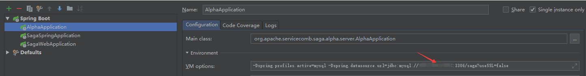
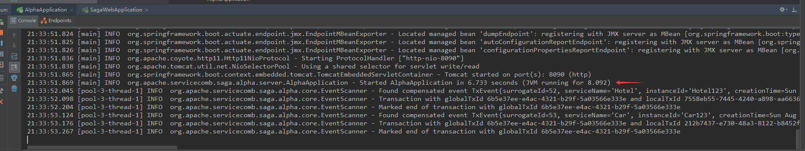
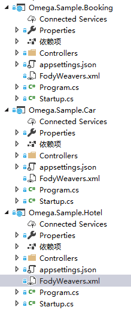
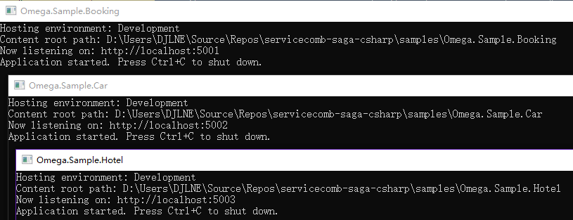
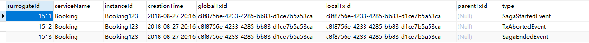
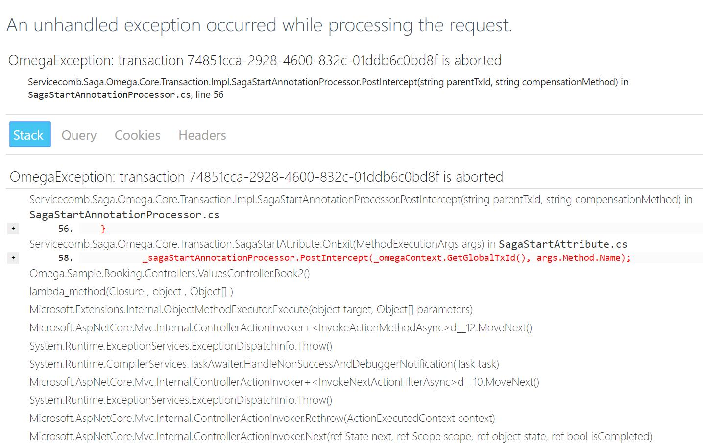
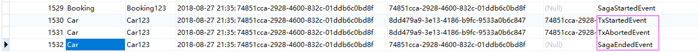

# Saga基本使用指南

## 使用前置条件说明

> 如果还有同学对Saga还不甚了解的同学,可以参考Saga官方中文地址[https://github.com/apache/incubator-servicecomb-saga/blob/master/README_ZH.md](https://github.com/apache/incubator-servicecomb-saga/blob/master/README_ZH.md),同时可以参考此项目贡献者之一的[@WithLin](https://github.com/WithLin)的一篇中文说明文章,该地址如下:[https://www.jianshu.com/p/dfe7a4c05992](https://www.jianshu.com/p/dfe7a4c05992),文章由浅入深的讲述了分布式事务在微服务场景下的重要性,以及Saga对分布式事务的大致实现方式和后续的思考

* **必须** 你需要可用的一个本地或者远程的数据库(mysql或者postpresql)作为Saga持久化分布式事务事件的持久化存储,当然只要官方支持的Database Provider即可,具体idea数据库配置如下图,注意数据库的名字与您真实数据库名一致



* **必须** 成功启动alpha-server,导致环境搭建以及部署颇为麻烦,后期官方将会提供image上传docker hub提供给大家使用,启动成功参考下图



* **可选** 同时saga提供了UI可视化界面,直接idea中启动saga-web即可

* **支持docker-compose**:根目录提供了一个dockercompose文件,只需要在工程的根目录下执行docker-compose up -d 即可，上面的操作可以给感兴趣的调试环境的搭建。


## 开始玩转分布式事务Saga

克隆当前项目,然后请使用VS2017打开解决方案定位到sample目录,你会看到如下所示的三个实例应用程序,这里app都是基于TargetFramework=netcoreapp2.0的,所以需要相应的启动环境



下面对上图做一个基本介绍,假定现在我们有三个微服务,分别是 Booking-预定服务,Car-订车服务,Hotel-酒店服务,相信大家一看便知,三者的从属关系以及在现实社会中的关联关系,下面我们的分布式事务一致性测试将在这几个app中完成,现在我们分别对项目做一定的初始化工作

```csharp
services.AddOmegaCore(option =>
{
    // your alpha-server address
    option.GrpcServerAddress = "localhost:8080";
    // your app identification
    option.InstanceId = "Booking123";
    // your app name
    option.ServiceName = "Booking";
});
```

这里需要对三个项目都做如上所示的基本配置即可,现在一直都配置就绪了,下面开始我们的分布式事务的测试吧...

## 分布式事务场景测试

下面将会针对正常以及异常情况分别测试

### 正常情况测试

> 由 Booking 发起预定汽车和预定酒店的服务,且假设三个服务均可以正常访问的情况,正常启动如下图所示:


```csharp
        [HttpGet, SagaStart] // SagaStart 顾名思义标记为分布式事务开始的地方
        [Route("book1")]
        public ActionResult Book()
        {
            // init basic httpclient
            var httpClient = new HttpClient();
            // mark a reservation of car
            httpClient.GetAsync("http://localhost:5002/api/values");
            // book a hotel
            httpClient.GetAsync("http://localhost:5003/api/values");
            // your busniess code
            // for example save the order to your database
            return Ok("ok");
        }
```

请求结果返回"ok",结果我们看看数据记录的是什么东西,相信也是大家比较关心的,看懂了数据库也就了解了分布式事务的阶段性事件存储,下面直接上图:


我们从上图很明显的就能看出来服务的先后关系以及服务之间的依赖关系,同时LocalTxId标记了每个一个过程的唯一ID,其中[type]需要注重说明一下,标记了每个动作了的状态同时也是判断每个微服务是否成功是否需要补偿的重要标准( 特别说明: sample项目中的预定车辆以及预定酒店是模拟操作,具体可以参见各自项目代码 )

### 节点服务异常情况

> 这里我为什么要说节点服务异常呢?相信经历过微服务的同学就知道,错综复杂的服务之间的调用,就会增加耦合以及某个节点服务出现异常导致整个调用连失败的情况,所以基于如此我们下面测试每个阶段所带来的情况分析

```csharp
        [HttpGet, SagaStart]
        [Route("book1")]
        public ActionResult Book1()
        {
            // throw new a exception for test
            throw new DbUpdateException("I'm a dbUpdateException", new Exception());
            // init basic httpclient
            var httpClient = new HttpClient();
            // mark a reservation of car
            httpClient.GetAsync("http://localhost:5002/api/values").Wait();
            // book a hotel
            httpClient.GetAsync("http://localhost:5003/api/values").Wait();
            return Ok("ok");
        }
```

这里只是记录[Book1]本身服务的生命周期,因为还没有请求car和hotel,下面截图也验证我的预期结果:



#### 测试Car-Service调用异常

> 这里需要特别说明的是,需要 httpClient 等待微服务调用结果,这样car-service出现调用异常,我们的框架才会感知到,才会上报通知事务管理,最后终止或者回滚事务链条

Omega.Sample.Booking -> ValuesController:

```csharp
        [HttpGet, SagaStart]
        [Route("book2")]
        public ActionResult Book2()
        {
            // init basic httpclient
            var httpClient = new HttpClient();
            // mark a reservation of car , this will be throw a exception from car-service
            httpClient.GetAsync("http://localhost:5002/api/values").Wait();
            // book a hotel
            httpClient.GetAsync("http://localhost:5003/api/values").Wait();
            return Ok("ok");
        }
```

Omega.Sample.Car -> ValuesController :

```csharp
        [HttpGet]
        public IEnumerable<string> Get()
        {
            CarBookingService carBookingService = new CarBookingService();
            var carbook = new CarBooking()
            {
                Id = 1,
                Amount = 1,
                Name = "WithLin"
            };
            carBookingService.Order(carbook);
            return new string[] { "value1", "value2" };
        }
```

Omega.Sample.Car -> CarBookingService:

```csharp
    public class CarBookingService
    {
        private readonly ConcurrentDictionary<int, CarBooking> _bookings = new ConcurrentDictionary<int, CarBooking>();


        [Compensable(nameof(CancelCar))]
        public void Order(CarBooking carBooking)
        {
            carBooking.Confirm();
            _bookings.TryAdd(carBooking.Id, carBooking);
            // throw new Exception
            throw new Exception("test car serivice error");
        }

        void CancelCar(CarBooking booking)
        {
            _bookings.TryGetValue(booking.Id, out var carBooking);
            carBooking?.Cancel();
        }
    }
```

果不其然我们的[Book2]方式直接向我们抛出了异常,上图说明:



那么再来看看数据是否和我们预期感觉一样讷,相信聪明的小伙伴应该知道套路是什么了:



关于 car-service 的红框状态描述相信大家就很清楚了,历经了开始->中止->结束,最后整个 Booking 方式完成

#### 测试Hotel-Service调用异常

> 预期调用 Hotel-Service 异常,但是我们的 car-service 调用成功,这个时候我们需要 car-service 通过补偿的方式撤销调用 car-service 带来的数据或者状态的变化,达到要么全部成功,要么全部失败的结果,实现最终一致性

Omega.Sample.Booking -> ValuesController:

```csharp
        [HttpGet, SagaStart]
        [Route("book")]
        public async Task<ActionResult> Book()
        {
            // init basic httpclient
            var httpClient = new HttpClient();
            // mark a reservation of car
            await httpClient.GetAsync("http://localhost:5002/api/values");
            // book a hotel
            await httpClient.GetAsync("http://localhost:5003/api/values");
            return Ok("ok");
        }
```

Omega.Sample.Car -> ValuesController :

```csharp
        [HttpGet]
        public IEnumerable<string> Get()
        {
            CarBookingService carBookingService = new CarBookingService();
            var carbook = new CarBooking()
            {
                Id = 1,
                Amount = 1,
                Name = "WithLin"
            };
            carBookingService.Order(carbook);
            return new string[] { "value1", "value2" };
        }
```

Omega.Sample.Car -> CarBookingService:

> 这里需要特别说明 [Compensable(nameof(CancelCar))] 此标记是指示补偿或者回滚时的方法,当然它的执行是在事务官发起通知的时候执行,具体参考下图断点命中

```csharp
    public class CarBookingService
    {
        private readonly ConcurrentDictionary<int, CarBooking> _bookings = new ConcurrentDictionary<int, CarBooking>();


        [Compensable(nameof(CancelCar))]
        public void Order(CarBooking carBooking)
        {
            carBooking.Confirm();
            _bookings.TryAdd(carBooking.Id, carBooking);
            //throw new Exception("test car serivice error");
        }

        void CancelCar(CarBooking booking)
        {
            _bookings.TryGetValue(booking.Id, out var carBooking);
            carBooking?.Cancel();
        }
    }
```

Omega.Sample.Hotel -> ValuesController :

```csharp
        [HttpGet]
        public IEnumerable<string> Get()
        {
            HotelBookingService bookingService = new HotelBookingService();
            HotelBooking hotelBooking = new HotelBooking()
            {
                Id = 1,
                Amount = 10,
                Name = "test"
            };
            bookingService.Order(hotelBooking);
            return new string[] { "value1", "value2" };
        }
```

Omega.Sample.Hotel -> HotelBookingService:

> 注意这里因为 booking.Amount > 2 将会触发异常导致服务调用错误

```csharp
        [Compensable(nameof(CancelHotel))]
        public void Order(HotelBooking booking)
        {
            if (booking.Amount > 2)
            {
                throw new ArgumentException("can not order the rooms large than two");
            }
            booking.Confirm();
            _bookings.TryAdd(booking.Id, booking);
        }
```

Car-Service 补偿方法触发执行命中断点如下图:


数据库事务链条状态图(聪明的你观察到了那个补偿事件的记录了讷):


#### 测试Booking-Service 最后调用异常

> 这里我们最后再来测试一下,如下情况,也是前面的 car-service hotel-service 调用都没有问题,但是最后 booking-service 提交的出现了未知异常(例如网络抖动.数据库闪断之类),代码我就不贴太多了,展示 booking-service 即可

```csharp
        [HttpGet, SagaStart]
        [Route("book")]
        public async Task<ActionResult> Book()
        {
            // init basic httpclient
            var httpClient = new HttpClient();
            // mark a reservation of car (no exception)
            await httpClient.GetAsync("http://localhost:5002/api/values");
            // book a hotel (no exception)
            await httpClient.GetAsync("http://localhost:5003/api/values");
            throw new Exception("just test unknown exception");
            return Ok("ok");
        }
```

理所当然的如下图所示:

> 关于 Command 表大致用来存储需要补偿的命令的,相应的alpha-server有定时服务在刷这个表,一直补偿成功为止,来保证最终的分布式事务的一致性


> 相信你已经注意到了我们的两个预定服务都触发了补偿逻辑(红框所示)


#### 如何在服务超时情况维持分布式事务测试

未完待续...
